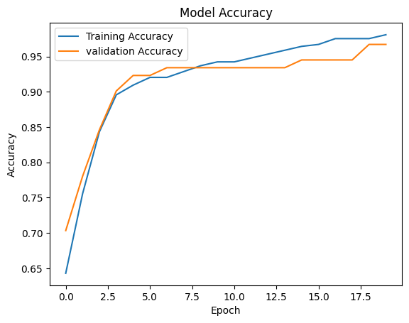
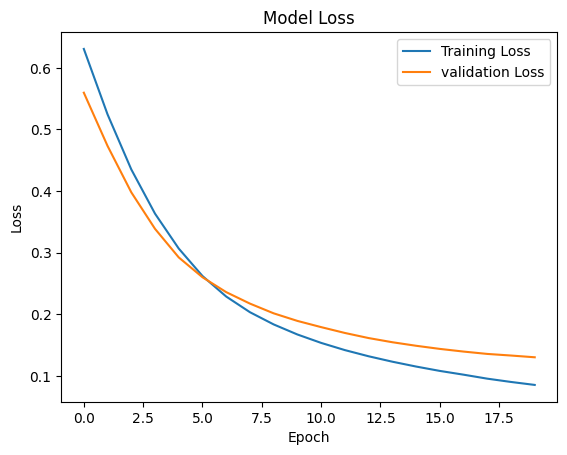

## Constructing a Deep Neural Network for Binary Classification Using TensorFlow

---

### Aim
To design, train, and evaluate a Deep Neural Network (DNN) for solving a binary classification problem using TensorFlow and Keras.

--- 

### Scope
This practical focuses on implementing a complete deep learning workflow for binary classification, including data preprocessing, model construction, training, evaluation, and prediction using TensorFlow.

---

### Dataset
**Breast Cancer Wisconsin Diagnostic Dataset**

### Dataset Source
[Kaggle – Breast Cancer Wisconsin Diagnostic Dataset](https://www.kaggle.com/datasets/uciml/breast-cancer-wisconsin-data)

- 569 samples
- 30 numerical features
- Binary target: `0` = Malignant, `1` = Benign

---

### Libraries Used
- TensorFlow
- Keras
- NumPy
- Pandas
- Matplotlib
- Scikit-learn

---

### Data Preprocessing

The following sequence is applied strictly to prevent data leakage:

```
Train/Test Split  (80% train / 20% test, random_state=42)
        ↓
Fit StandardScaler on Training Data
        ↓
Transform Training Data
        ↓
Transform Test Data
```

> **Important:** `StandardScaler` is fitted **only on the training data**. The same fitted scaler is then used to transform the test data. Fitting on the full dataset before splitting would leak test-set statistics into training, which is incorrect.

---

### Model Architecture

| Layer          | Configuration    |
|----------------|------------------|
| Input Layer    | 30 features      |
| Hidden Layer 1 | 32 neurons, ReLU |
| Hidden Layer 2 | 16 neurons, ReLU |
| Output Layer   | 1 neuron, Sigmoid|

---

### Model Compilation

|   Setting     |          Value      |
|---------------|-------------------- |
| Optimizer     |        Adam         |
| Loss Function | Binary Crossentropy |
| Metric        |        Accuracy     |

---

### Model Training

| Setting         | Value                     |
|-----------------|-------------------------- |
| Epochs          | 100                       |
| Batch Size      | 32                        |
| Validation Split| 0.2 (20% of training data) |

---

### Performance Evaluation

The notebook evaluates the trained model using the following metrics:

- Accuracy
- Confusion Matrix
- Precision
- Recall
- F1-Score
- Prediction for new samples

---

### Part E – Experimental Analysis

The notebook compares model performance across four experiments using the same train/test split and standardized data throughout:

1. **Different numbers of hidden layers** — 1, 2, and 3 hidden layers
2. **Different numbers of neurons** — 8, 16, and 32 neurons per layer
3. **Optimizers** — Adam vs SGD
4. **Activation functions** — ReLU vs Tanh vs Sigmoid

The final comparison is presented as a single table containing the experimental configuration and test accuracy for each run.

---

### Results and Outcome


#### Performance Metrics

| Metric | Result |
|---|---:|
Test Loss: 0.1248849481344223
Test Accuracy: 0.9649122953414917
Accuracy: 0.9649122807017544
Precision: 0.958904109589041
Recall: 0.9859154929577465
F1 Score: 0.9722222222222222

#### Confusion Matrix

[[40  3]
 [ 1 70]]


#### Training and Validation Accuracy



#### Training and Validation Loss



---

### Repository Structure

```
practical2/
├── practical2.ipynb     # Main notebook (Parts A–E)
├── requirements.txt     # Python dependencies
├── README.md            # This file
├── accuracy_plot.png    # Accuracy graph (generated on run)
└── loss_plot.png        # Loss graph (generated on run)
```

---
## Part E – Experimental Analysis

The experimental analysis was performed to study the effect of different neural-network architectures, neuron counts, optimizers, and activation functions on the classification performance.

All experiments were evaluated using **Test Accuracy**.

### 18. Effect of Number of Hidden Layers

The model was tested with different numbers of hidden layers while keeping the other parameters consistent.

| Hidden Layers | Neurons | Activation | Optimizer | Test Accuracy |
|---:|---:|---|---|---:|
| 1 | 16 | ReLU | Adam | **98.25%** |
| 2 | 16 | ReLU | Adam | 96.49% |
| 3 | 16 | ReLU | Adam | 97.37% |

**Observation:**  
The model with **1 hidden layer** achieved the highest accuracy of **98.25%** among the tested hidden-layer configurations. Increasing the number of hidden layers to 2 or 3 did not improve the performance in this experiment.

---

### 19. Effect of Number of Neurons

The number of neurons was varied while keeping the other configuration consistent.

| Hidden Layers | Neurons | Activation | Optimizer | Test Accuracy |
|---:|---:|---|---|---:|
| 2 | 8 | ReLU | Adam | **98.25%** |
| 2 | 16 | ReLU | Adam | 97.37% |
| 2 | 32 | ReLU | Adam | 97.37% |

**Observation:**  
The configuration with **8 neurons** achieved the highest accuracy of **98.25%**. Increasing the number of neurons to 16 or 32 did not improve the test performance in this experiment.

---

### 20. Comparison of Adam and SGD Optimizers

The Adam and SGD optimizers were compared using the same network configuration.

| Hidden Layers | Neurons | Activation | Optimizer | Test Accuracy |
|---:|---:|---|---|---:|
| 2 | 16 | ReLU | Adam | **97.37%** |
| 2 | 16 | ReLU | SGD | 95.61% |

**Observation:**  
**Adam** performed better than **SGD** in this experiment. Adam achieved a test accuracy of **97.37%**, compared with **95.61%** for SGD.

---

### 21. Comparison of Activation Functions

The following activation functions were evaluated using the same network configuration:

- ReLU
- Tanh
- Sigmoid

| Hidden Layers | Neurons | Activation | Optimizer | Test Accuracy |
|---:|---:|---|---|---:|
| 2 | 16 | ReLU | Adam | 96.49% |
| 2 | 16 | Tanh | Adam | 98.25% |
| 2 | 16 | Sigmoid | Adam | **99.12%** |

**Observation:**  
The **Sigmoid activation function** achieved the highest test accuracy of **99.12%**, followed by **Tanh** with **98.25%** and **ReLU** with **96.49%**.

---

### 22. Overall Experimental Comparison

| Experiment | Configuration | Test Accuracy |
|---|---|---:|
| Hidden Layers | 1 Hidden Layer, 16 Neurons | **98.25%** |
| Hidden Layers | 2 Hidden Layers, 16 Neurons | 96.49% |
| Hidden Layers | 3 Hidden Layers, 16 Neurons | 97.37% |
| Neurons | 2 Hidden Layers, 8 Neurons | **98.25%** |
| Neurons | 2 Hidden Layers, 16 Neurons | 97.37% |
| Neurons | 2 Hidden Layers, 32 Neurons | 97.37% |
| Optimizer | Adam | 97.37% |
| Optimizer | SGD | 95.61% |
| Activation | ReLU | 96.49% |
| Activation | Tanh | 98.25% |
| Activation | Sigmoid | **99.12%** |

---

### Best Performing Configuration

| Parameter | Best Configuration |
|---|---|
| Experiment | **Sigmoid Activation** |
| Hidden Layers | **2** |
| Neurons | **16** |
| Activation | **Sigmoid** |
| Optimizer | **Adam** |
| Test Accuracy | **99.12%** |

### Final Observation

The **2-hidden-layer DNN with 16 neurons, Sigmoid activation, and Adam optimizer** achieved the highest test accuracy among all configurations evaluated in Part E.

The best test accuracy was:

> **99.12%**

The experimental results show that changing the network depth, number of neurons, optimizer, and activation function can affect classification performance. In this experiment, the **Sigmoid activation configuration produced the best overall test accuracy**.
---


### How to Run

```bash
pip install -r requirements.txt
jupyter notebook practical2.ipynb
```

---

### Author

**Name:** Komali Velangani Rongali
**Email:**  komalivelangani1011@gmail.com
**Course:** B.Tech – Deep Learning Practical
